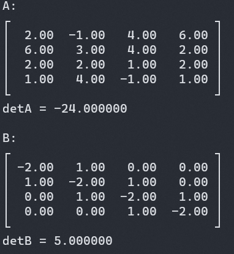

# Matrix implementation written in C

## About this
A tiny, low level C program which treats a matrix.

> **Warning**
> This project is in development.



## Features
Functions supported are:
- adding two matrices
- displaying a matrix
- calculating a matrix product
- simplifying a matrix
- calculating the inverse matrix
- calculating the determinant

## How to build a static or shared library
```shell
git clone https://github.com/atoy322/matc.git
cd matc
make static
# make shared
```

## How to use
```C:main.c
#include <matc.h>

int main() {
    // Allocate memory for array. (column=10, row=10)
    matrix_t A = matcInit(10, 10);
    matrix_t B = matcInit(10, 10);
    matrix_t Dest = matcInit(10, 10);

    // Set a value in the way follow.
    A.array[0][0] = 1;
    B.array[9][9] = 1;

    // Dest = A + B
    // All arrays must have same shape and type.
    matcAdd(A, B, Dest);

    // Calculate matrix product.
    matcDot(A, B, Dest);

    // Display array data.
    matcDisplay(Dest);

    // Free memory allocated by init function.
    matcDeinit(A);
    matcDeinit(B);
    matcDeinit(Dest);

    return 0;
}
```

and then
```shell
gcc -c {your c program}.c -I./libmatc/include
gcc {your c program}.o -o main.exe -L./libmatc/lib/libmatc.a -lmatc 
```
